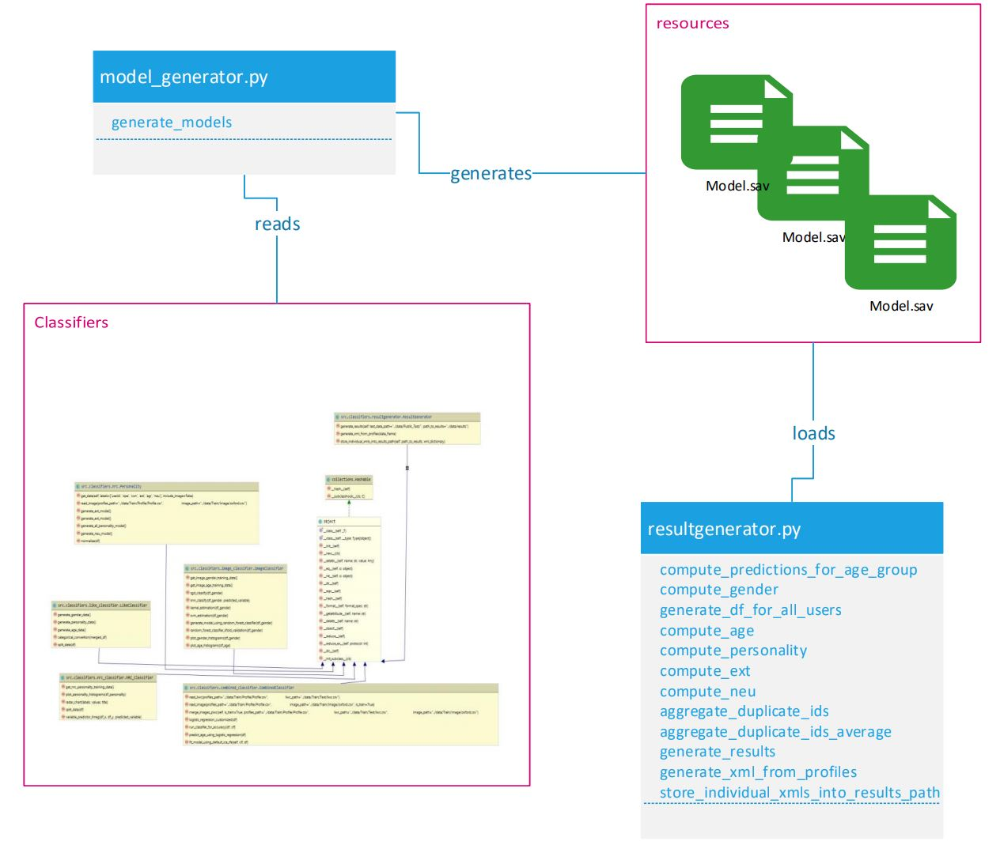

- [Overview](#overview) 
- [Set up your environment](#env)
- [Architecture](#architect)


<a name="overview"></a>
## Introduction 
This repository contains the source code for the ift6758 course. 

<a name="env"></a>
## Set up your environment

Follow the below steps to set up your virtual environment:


1) Make sure that you have installed on your local machine:

    ```pip install virtualenv```
2) Create a virtual environment:

    ```virtualenv venv```
3) Activate the virtual environment:

   - On Windows:

    ```venv/Scripts/activate``` 
    
   - On Mac/Linux
   
   ```source venv/bin/activate``` 
4) Install the project requirements on the virtual environment:

    ```pip install -r requirements.txt```

Assuming you have the Train/ test data as below in the root of the project:
 - data/Public_Test
   - Image
     - oxford.csv
   - Profile
     - Profile.csv
   - Relation
     - Relation.csv
   - Text
     - liwc.csv
     - nrc.csv
     
 - data/Train
   - Image
     - oxford.csv
   - Profile
     - Profile.csv
   - Relation
     - Relation.csv
   - Text
     - liwc.csv
     - nrc.csv

Follow below steps to generate the models and predict the test data
- Navigate to source directory: `cd src`

- generate model: `python model_generator.py`
- Now you have models generated, you can use test data to predict and generate xml files (under data/results)
- predict: `python resultgenerator.py` 


<a name="architect"></a>
## Architecture
Below is the architecture of the system.

 
